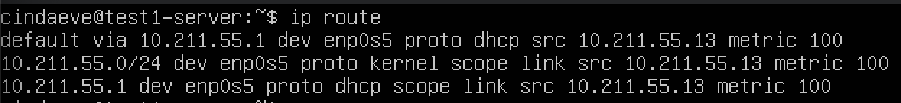
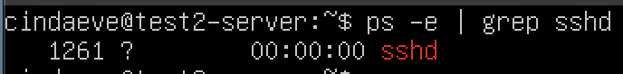
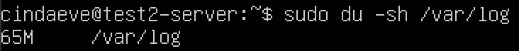

## Part 1. Установка ОС
- cat /etc/issue Текущая версия ubuntu 
- 
## Part 2. Создание пользователя
- sudo useradd test1 Вызов команды для создания пользователя 
- 
- sudo usermod -aG adm test1 Добавление пользователя в группу 
- 
- cat /etc/passwd Вывод нового пользователя в выводе команды 
- 
## Part 3. Настройка сети ОС
- 1. hostnamectl set-hostname test1-server Установка имени машины вида test1-server
- 
- hostnamectl Отображение имени машины
- 
- 2. Установить временную зону, соответствующую вашему текущему местоположению.
- timedatectl Отображение текущей даты и времени
- 
- timedatectl list-timezones | grep Moscow Поиск названия временной зоны Москвы
- 
- timedatectl set-timezone Europe/Moscow Установка Московского времени
- 
- 3. Вывести названия сетевых интерфейсов с помощью консольной команды.
- sudo apt install net-tools Установка набора сетевых инструментов 
- 
- ifconfig Вывод списка сетевых интерфейсов и информацию о них, такую как состояние, IP адрес, MAC адрес и другие параметры
- 
- lo (loopback device) – виртуальный интерфейс, присутствующий по умолчанию в любом Linux. Он используется для отладки сетевых программ и запуска серверных приложений на локальной машине. С этим интерфейсом всегда связан адрес 127.0.0.1. У него есть dns-имя – localhost.
- 4. Используя консольную команду получить ip адрес устройства, на котором вы работаете, от DHCP сервера.
- hostname -I Получить ip адрес устройства от DHCP сервера
- 
- DHCP (Dynamic Host Configuration Protocol) - протокол автоматической настройки сетевых параметров. Он предоставляет устройствам в компьютерных сетях IP-адреса, подсети, шлюзы, DNS-серверы и другие настройки. DHCP облегчает процесс настройки, предотвращает конфликты адресов, позволяет динамически выделять IP-адреса и управлять параметрами сети.
- 5. Определить и вывести на экран внешний ip-адрес шлюза (ip) и внутренний IP-адрес шлюза, он же ip-адрес по умолчанию (gw).
- curl ifconfig.me Внешний ip адресс шлюза
- 
- ip route Внутренний ip адрес шлюза
- 
- 6. Задать статичные (заданные вручную, а не полученные от DHCP сервера) настройки ip, gw, dns (использовать публичный DNS серверы, например 1.1.1.1 или 8.8.8.8).
- sudo vim /etc/netplan/00-installer-config.yaml Открытие файла для ручной установки
- было
- 
- стало
- 
- sudo netplan apply Применили изменения
- 
- 7. Перезагрузить виртуальную машину. Убедиться, что статичные сетевые настройки (ip, gw, dns) соответствуют заданным в предыдущем пункте.
- reboot Перезагрузили 
- ifconfig проверяем что адреса соответствуют заданным
- 
- ping 1.1.1.1 и ping ya.ru Проверяем усспешно ли пропингуются удаленные хосты 1.1.1.1 и ya.ru
- 
## Part 4. Обновление ОС
- sudo apt update Получить пакеты для обновления. sudo apt upgrade Обновить системные пакеты до последней на момент выполнения задания версии. reboot Перезагрузить после обновления.
- 
## Part 5. Использование команды sudo
- sudo usermod -aG sudo test1 Разрешить пользователю, созданному в Part 2, выполнять команду sudo.
- 
- getent group sudo Посмотреть список группы sudo
- 
- В отчёте объяснить истинное назначение команды sudo
- sudo - Основное назначение sudo состоит в том, чтобы предоставить временный и контролируемый доступ к выполнению команд, которые обычно требуют прав администратора. Это помогает уменьшить риск непреднамеренных или вредоносных действий, которые могли бы произойти, если бы пользователь всегда работал с полными правами суперпользователя. По умолчанию, при установке Ubuntu первому пользователю (тому, который создаётся во время установки) предоставляются полные права на использование sudo. Т.е. фактически первый пользователь обладает той же свободой действий, что и root.
- Поменять hostname ОС от имени пользователя, созданного в пункте Part 2 (используя sudo).
- su test1 Меняем пользователя на test1
- 
- cat /etc/hostname Просмотр текущего имени хоста
- sudo hostnamectl set-hostname test2-server Смена имени хоста
- 
## Part 6. Установка и настройка службы времени
- Настроить службу автоматической синхронизации времени.
- timedatectl Вывести время, часового пояса, в котором вы сейчас находитесь.
- timedatectl show Предоставляет обзор текущих настроек даты и времени на вашем компьютере
- 
## Part 7. Установка и использование текстовых редакторов
- Установить текстовые редакторы VIM (+ любые два по желанию NANO, MCEDIT, JOE и т.д.)
- sudo apt install vim Установка VIM
- 
- sudo apt install nano Установка Nano
- 
- sudo apt install mcedit Установка Mcedit
- 
- Используя каждый из трех выбранных редакторов, создайте файл test_X.txt, где X -- название редактора, в котором создан файл. Напишите в нём свой никнейм, закройте файл с сохранением изменений.
- VIM
- vim test_vim.txt Создать файл с именем test_vim.txt
- i Режим редактировани
- esc Выйти из режима редактирования
- :wq Выход с сохранением изменений
- 
- NANO
- nano test_nano.txt Создать файл с именем test_nano.txt
- ctrl + x, затем Y и Enter Выйти с сохранением изменений
- 
- MCEDIT
- mcedit test_mcedit.txt Создать файл с именем test_mcedit.txt
- F2 "сохранить" Сохранить файл
- F10 Выйти из файла
- 
- Используя каждый из трех выбранных редакторов, откройте файл на редактирование, отредактируйте файл, заменив никнейм на строку "21 School 21", закройте файл без сохранения изменений.
- VIM
- :q! Выйти без сохранения
- 
- NANO
- ctrl + x, затем N и Enter Выйти без сохранения изменений
- 
- MCEDIT
- F10 "нет" Выйти из файла без сохранения
- 
- Используя каждый из трех выбранных редакторов, отредактируйте файл ещё раз (по аналогии с предыдущим пунктом), а затем освойте функции поиска по содержимому файла (слово) и замены слова на любое другое.
- VIM
- / Поиск слова
- 
- s/слово1/слово2 Замена слово1 на слово2
- 
- NANO
- ctrl + w Поиск слова
- 
- ctrl + \ Замена слов на другое
- 
- MCEDIT
- F7 Поиск слова
- 
- F4 "дальше" Замена слова на другое
- 
## Part 8. Установка и базовая настройка сервиса SSHD
- 1. Установить службу SSHd.
- sudo apt-get install ssh Команда устанавливает клиентский компонент SSH на вашем компьютере
- sudo apt install openssh-server Команда устанавливает серверный компонент OpenSSH на вашем компьютере
- 
- 2. Добавить автостарт службы при загрузке системы.
- sudo systemctl enable ssh Команда активирует автоматический запуск службы SSH при загрузке операционной системы
- systemctl status ssh Команда показывает текущий статус службы SSH
- 
- 3. Перенастроить службу SSHd на порт 2022.
- sudo vim /etc/ssh/sshd_config Перенастройка порта путем раскомментирования порта
- 
- 4. Используя команду ps, показать наличие процесса sshd. Для этого к команде нужно подобрать ключи. В отчёте объяснить значение команды и каждого ключа в ней.
- ps -e | grep sshd Используется для поиска всех процессов, связанных с SSH-сервером (демоном SSH) в списке активных процессов вашей системы
- ps (показывает запущенные процессы, выполняемые пользователем в окне терминала);
- ps -e или ps -A (Чтобы просмотреть все запущенные процессы);
- ps -d (Чтобы показать все процессы, кроме лидеров сессии);
- ps -d -N (можно инвертировать вывод с помощью переключателя -N. Например, если хочу вывести только лидеров сеансов)
- ps T (увидеть только процессы, связанные с этим терминалом);
- ps r (просмотреть все работающие (running) процессы);
- ps -p 'pid' (если вы знаете идентификатор процесса PID, вы можете просто использовать следующую команду, для вывода процесса с этим 'pid');
- ps -p 'pid1' 'pid2'
- ps U 'userlist' (найти все процессы, выполняемые конкретным пользователем);
- ps -ef (получить полный список);
- 
- 5. Перезагрузить систему.
- systemctl restart sshd Перезапуск службы ssh
- netstat -tan Oтображает список активных сетевых подключений и слушающих портов на вашем компьютере
- -t (--tcp) отображает соедниеня только по tcp
- -a (--all) вывод всех активных подключений TCP
- -n (--numeric) вывод активных подключений TCP с отображением адресов и номеров портов в числовом формате
- Proto: Название протокола (протокол TCP или протокол UDP);
- recv-Q: очередь получения сети
- send-Q: Сетевая очередь отправки
- Local Address адрес локального компьтера и используемы номер порта
- Foreign Address адрес и номер удаленного компьтера к которомц подключен сокет
- State состояние сокетoв
- 0.0.0.0 означает IP-адрес на локальной машине
- 
## Part 9. Установка и использование утилит top, htop
- Установить и запустить утилиты top и htop.
- sudo apt install htop Установка htop
- 
- top Запуск top
- 
- По выводу команды top определить и написать в отчёте:
- uptime 1:14
- количество авторизованных пользователей 1 
- общую загрузку системы 0,00 0,00 0,00
- общее количество процессов 103
- загрузку cpu 0
- загрузку памяти 1967,3
- pid процесса занимающего больше всего памяти 1025
- 
- pid процесса, занимающего больше всего процессорного времени 419
- 
- В отчёт вставить скрин с выводом команды htop:
- отсортированному по PID
- 
- отсортированному по PERCENT_CPU
- 
- отсортированному по PERCENT_MEM
- 
- отсортированному по TIME
- 
- отфильтрованному для процесса sshd
- 
- с процессом syslog, найденным, используя поиск
- 
- с добавленным выводом hostname, clock и uptime
- 
## Part 10. Использование утилиты fdisk
- Запустить команду fdisk -l.
- 
- В отчёте написать:
- название жесткого диска Ubuntu Linux-O S
- размер 8 GiB
- количество секторов 16777216
- 
- размер swap
- $ sudo fallocate -l 2G /swapfile создает файл подкачки размером 2 гигабайта в корневом каталоге системы
- $ sudo chmod 600 /swapfile изменяет права доступа к swap-файлу, ограничивая доступ только для пользователя root (администратора системы)
- $ ls -lh /swapfile выводит информацию о размере созданного swap-файла.
- $ sudo mkswap /swapfile создает область подкачки внутри swap-файла.
- $ sudo swapon /swapfile активирует swap-файл, включая его в систему как дополнительное пространство подкачки.
- $ swapon --show показывает текущие детали по активированной подкачке
- 
## Part 11. Использование утилиты df
- Запустить команду df.
- df -h вывод информации в читаемом формате
- В отчёте написать для корневого раздела (/):
- размер раздела 5,6G
- размер занятого пространства 5,0G
- размер свободного пространства 322M
- процент использования 95%
- 
- Запустить команду df -Th.
- В отчёте написать для корневого раздела (/):
- размер раздела 5,6G
- размер занятого пространства 5,0G
- размер свободного пространства 322M
- процент использования 95%
- ext4 тип файловой системы для раздела.
- 
## Part 12. Использование утилиты du
- Запустить команду du.
- du -h вывод информации в читаемом формате
- 
- Вывести размер папок /home, /var, /var/log (в байтах, в человекочитаемом виде)
- sudo du -sh /var в человекочитаемом виде
- 
- sudo du -s --block-size=1 /var в байтах 
- 
- sudo du -sh /home в человекочитаемом виде
- 
- sudo du -s --block-size=1 /home в байтах 
- 
- sudo du -sh /var/log в человекочитаемом виде
- 
- sudo du -s --block-size=1 /var/log в байтах 
- 
- Вывести размер всего содержимого в /var/log (не общее, а каждого вложенного элемента, используя *)
- sudo du -h /var Вывести размер всего содержимого
- 
- sudo du -h /home Вывести размер всего содержимого
- 
- sudo du -h /var/log Вывести размер всего содержимого
- 
## Part 13. Установка и использование утилиты ncdu
- sudo apt install ncdu Установить утилиту ncdu.
- 
- Вывести размер папок /home, /var, /var/log.
- ncdu /var Вывести размер папки var
- 
- ncdu /home Вывести размер папки home
- 
- ncdu /var/log Вывести размер папки /var/log
- 
## Part 14. Работа с системными журналами
- Открыть для просмотра:
- 1. sudo vim /var/log/dmesg открытие лога в vim
- 
- 2. sudo vim /var/log/syslog открытие лога в vim
- 
- 3. sudo vim /var/log/auth.log открытие лога в vim
- 
- Написать в отчёте:
- время последней успешной авторизации Август 17:32:54
- имя пользователя cindaeve
- метод входа в систему pam_unix

- sudo systemctl restart ssh Перезапустить службу SSHd
- 
- Вставить в отчёт скрин с сообщением о рестарте службы (искать в логах).
- 
## Part 15. Использование планировщика заданий CRON
- sudo crontab -e Открыть программу CRON
- Используя планировщик заданий, запустите команду uptime через каждые 2 минуты.
- 
- Найти в системных журналах строчки (минимум две в заданном временном диапазоне) о выполнении.
- 
- sudo crontab -l Вывести на экран список текущих заданий для CRON.
- 
- sudo crtontab -r Удалите все задания из планировщика заданий.
- sudo crontab -l Вывести на экран список текущих заданий для CRON.
- 
