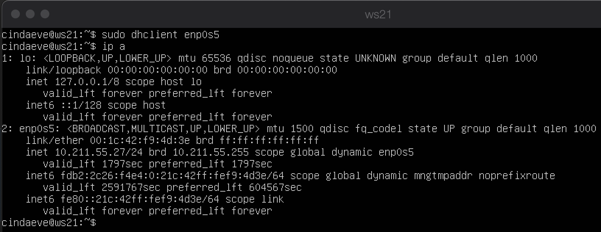
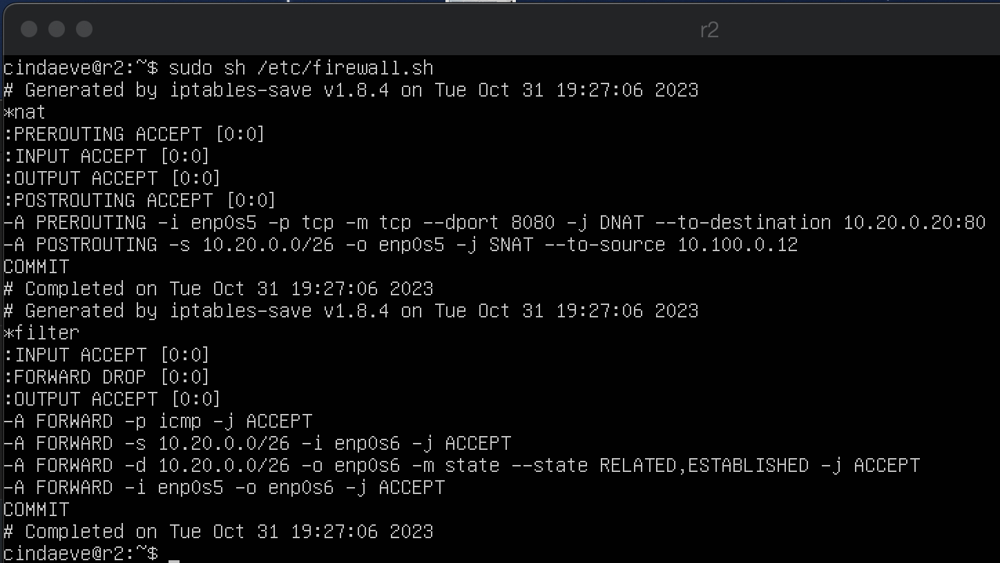
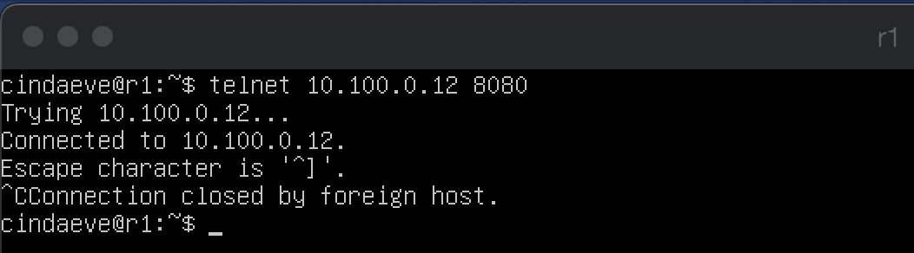

## Part 1. Инструмент ipcalc
- 
- устанавливаем ipcalc
- 1.1. сети и маски
- 
- 1) адрес сети 192.167.38.54/13
- 
- 2) перевод маски 255.255.255.0 в префиксную и двоичную запись, /15 в обычную и двоичную, 11111111.11111111.11111111.11110000 в обычную и префиксную
- 
- 3) минимальный и максимальный хост в сети 12.167.38.4 при масках: /8, 11111111.11111111.00000000.00000000, 255.255.254.0 и /4
- 1.2. localhost
- Определить и записать в отчёт, можно ли обратиться к приложению, работающему на localhost, со следующими IP: 194.34.23.100, 127.0.0.2, 127.1.0.1, 128.0.0.1
- ping 194.34.23.100 и 128.0.0.1 - нельзя
- ping 127.0.0.2 и 127.1.0.1 - можно
- 1.3. Диапазоны и сегменты сетей
- Определить и записать в отчёт:
- 1) какие из перечисленных IP можно использовать в качестве публичного, а какие только в качестве частных: 10.0.0.45, 134.43.0.2, 192.168.4.2, 172.20.250.4, 172.0.2.1, 192.172.0.1, 172.68.0.2, 172.16.255.255, 10.10.10.10, 192.169.168.1
- публичного 134.43.0.2, 172.0.2.1, 192.172.0.1, 172.68.0.2, 192.169.168.1
- частных 10.0.0.45, 192.168.4.2, 172.20.250.4, 172.16.255.255, 10.10.10.10
- 2) какие из перечисленных IP адресов шлюза возможны у сети 10.10.0.0/18: 10.0.0.1, 10.10.0.2, 10.10.10.10, 10.10.100.1, 10.10.1.255
- возможны 10.10.0.2, 10.10.10.10, 10.10.1.255
- невозможны 10.0.0.1, 10.10.100.1
## Part 2. Статическая маршрутизация между двумя машинами
- 
- С помощью команды ip a посмотреть существующие сетевые интерфейсы
- Описать сетевой интерфейс, соответствующий внутренней сети.
- lo (loopback device) – виртуальный интерфейс, присутствующий по умолчанию в любом Linux. Он используется для отладки сетевых программ и запуска серверных приложений на локальной машине. С этим интерфейсом всегда связан адрес 127.0.0.1. У него есть dns-имя – localhost. 
- ws1 127.0.0.1/8
- ws2 127.0.0.1/8
- enp0s5 – это имя сетевого интерфейса в Linux, следующее современной именовательной схеме, предоставленной systemd/udev.
- ws1 10.211.55.23/24
- ws2 10.211.55.24/24
- 
- на обеих машинах и задать следующие адреса и маски: ws1 - 192.168.100.10, маска /16, ws2 - 172.24.116.8, маска /12
- 
- Выполнить команду netplan apply для перезапуска сервиса сети
- 2.1. Добавление статического маршрута вручную

- Добавить статический маршрут от одной машины до другой и обратно при помощи команды вида ip r add. Пропинговать соединение между машинами
- 2.2. Добавление статического маршрута с сохранением
- 
- Перезапустить машины
- 
- Добавить статический маршрут от одной машины до другой с помощью файла etc/netplan/00-installer-config.yaml

- Пропинговать соединение между машинами
## Part 3. Утилита iperf3
- 3.1. Скорость соединения
- Перевести и записать в отчёт: 8 Mbps в MB/s, 100 MB/s в Kbps, 1 Gbps в Mbps
- 8 Mbps ==  1 MB/s, 
- 100 MB/s == 800000 Kbps, 
- 1 Gbps ==  1000 Mbps
- 3.2. Утилита iperf3
- 
- Измерить скорость соединения между ws1 и ws2
## Part 4. Сетевой экран
- 4.1. Утилита iptables
- sudo apt-get install iptables
- 
- Создать файл /etc/firewall.sh, имитирующий фаерволл, на ws1 и ws2:
- #!/bin/sh
- Удаление всех правил в таблице "filter" (по-умолчанию).
iptables -F
iptables -X
- Нужно добавить в файл подряд следующие правила:
- 1) на ws1 применить стратегию когда в начале пишется запрещающее правило, а в конце пишется разрешающее правило (это касается пунктов 4 и 5)
- 2) на ws2 применить стратегию когда в начале пишется разрешающее правило, а в конце пишется запрещающее правило (это касается пунктов 4 и 5)
- 3) открыть на машинах доступ для порта 22 (ssh) и порта 80 (http)
- 4) запретить echo reply (машина не должна "пинговаться”, т.е. должна быть блокировка на OUTPUT)
- 5) разрешить echo reply (машина должна "пинговаться")
- 
- Запустить файлы на обеих машинах командами chmod +x /etc/firewall.sh и /etc/firewall.sh
- В отчёте описать разницу между стратегиями, применёнными в первом и втором файлах.
- Разница между стратегиями в том, что первое правило запрещает исходящий трафик, а второе разрешает его, а в другом файле наоборот. Так как iptables обрабатывает правила по порядку, будет применено только первое правило в каждом файле.
- 4.2. Утилита nmap
- 
- Командой ping найти машину, которая не "пингуется", 
- 
- после чего утилитой nmap показать, что хост машины запущен. Проверка: в выводе nmap должно быть сказано: Host is up
- Сохранить дампы образов виртуальных машин
## Part 5. Статическая маршрутизация сети
- 
- Поднять пять виртуальных машин (3 рабочие станции (ws11, ws21, ws22) и 2 роутера (r1, r2))
- 5.1. Настройка адресов машин
- 
- 
- 
- 
- 
- Настроить конфигурации машин в etc/netplan/00-installer-config.yaml согласно сети на рисунке.
- sudo netplan apply
- 
- 
- 
- 
- 
- Перезапустить сервис сети. Если ошибок нет, то командой ip -4 a проверить, что адрес машины задан верно. Также пропинговать ws22 с ws21. Аналогично пропинговать r1 с ws11.
- 5.2. Включение переадресации IP-адресов.
- 
- Для включения переадресации IP, выполните команду на роутерах: sysctl -w net.ipv4.ip_forward=1
- 
- 
- Откройте файл /etc/sysctl.conf и добавьте в него следующую строку: net.ipv4.ip_forward = 1
- 5.3. Установка маршрута по-умолчанию
- 
- Настроить маршрут по-умолчанию (шлюз) для рабочих станций. Для этого добавить default перед IP роутера в файле конфигураций
- 
- Вызвать ip r и показать, что добавился маршрут в таблицу маршрутизации
- 
- Пропинговать с ws11 роутер r2 и показать на r2, что пинг доходит. Для этого использовать команду:
tcpdump -tn -i eth1
- 5.4. Добавление статических маршрутов
- 
- Добавить в роутеры r1 и r2 статические маршруты в файле конфигураций. Пример для r1 маршрута в сетку 10.20.0.0/26:
- Добавить в конец описания сетевого интерфейса eth1:
- to: 10.20.0.0
- via: 10.100.0.12
- 
- Вызвать ip r и показать таблицы с маршрутами на обоих роутерах. Пример таблицы на r1:
- 10.100.0.0/16 dev eth1 proto kernel scope link src 10.100.0.11
- 10.20.0.0/26 via 10.100.0.12 dev eth1
- 10.10.0.0/18 dev eth0 proto kernel scope link src 10.10.0.1
- 
- Запустить команды на ws11:
- ip r list 10.10.0.0/[маска сети] и ip r list 0.0.0.0/0
- В отчёте объяснить, почему для адреса 10.10.0.0/[маска сети] был выбран маршрут, отличный от 0.0.0.0/0, хотя он попадает под маршрут по-умолчанию.
- Если найден маршрут, который полностью соответствует адресу назначения (то есть маска подсети совпадает), то этот маршрут считается "наилучшим" и будет использоваться для отправки пакета. Маршрут по умолчанию (0.0.0.0/0) обычно находится в таблице маршрутизации и используется только в том случае, если нет других соответствующих маршрутов.
- 5.5. Построение списка маршрутизаторов
- 
- Запустить на r1 команду дампа: tcpdump -tnv -i eth0
- 
- При помощи утилиты traceroute построить список маршрутизаторов на пути от ws11 до ws21
- В отчёте, опираясь на вывод, полученный из дампа на r1, объяснить принцип работы построения пути при помощи traceroute.
- Программа traceroute выполняет отправку данных указанному узлу сети, при этом отображая сведения о всех промежуточных маршрутизаторах, через которые прошли данные на пути к целевому узлу. Для определения промежуточных маршрутизаторов traceroute отправляет серию пакетов данных целевому узлу, при этом каждый раз увеличивая на 1 значение поля TTL («время жизни»). Это поле обычно указывает максимальное количество маршрутизаторов, которое может быть пройдено пакетом. Первый пакет отправляется с TTL, равным 1, и поэтому первый же маршрутизатор возвращает обратно сообщение ICMP, указывающее на невозможность доставки данных. Traceroute фиксирует адрес маршрутизатора, а также время между отправкой пакета и получением ответа (эти сведения выводятся на монитор компьютера). Затем traceroute повторяет отправку пакета, но уже с TTL, равным 2, что позволяет первому маршрутизатору пропустить пакет дальше. Процесс повторяется до тех пор, пока при определённом значении TTL пакет не достигнет целевого узла. При получении ответа от этого узла процесс трассировки считается завершённым.
- 5.6. Использование протокола ICMP при маршрутизации

- Запустить на r1 перехват сетевого трафика, проходящего через eth0 с помощью команды:tcpdump -n -i eth0 icmp

- Пропинговать с ws11 несуществующий IP (например, 10.30.0.111) с помощью команды: ping -c 1 10.30.0.111
## Part 6. Динамическая настройка IP с помощью DHCP
- 
- Для r2 настроить в файле /etc/dhcp/dhcpd.conf конфигурацию службы DHCP:
- 1) указать адрес маршрутизатора по-умолчанию, DNS-сервер и адрес внутренней сети. Пример файла для r2:
- subnet 10.100.0.0 netmask 255.255.0.0 {}
- subnet 10.20.0.0 netmask 255.255.255.192
- {
-    range 10.20.0.2 10.20.0.50;
-    option routers 10.20.0.1;
-    option domain-name-servers 10.20.0.1;
- }
- 
- 2) в файле resolv.conf прописать nameserver 8.8.8.8.
- 
- Перезагрузить службу DHCP командой systemctl restart isc-dhcp-server.
- 
- Машину ws21 перезагрузить при помощи reboot и через ip a показать, что она получила адрес. Также пропинговать ws22 с ws21.
- 
- Указать MAC адрес у ws11, для этого в etc/netplan/00-installer-config.yaml надо добавить строки: macaddress: 10:10:10:10:10:BA, dhcp4: true
- Для r1 настроить аналогично r2, но сделать выдачу адресов с жесткой привязкой к MAC-адресу (ws11). Провести аналогичные тесты
- 
- Для r1 настроить в файле /etc/dhcp/dhcpd.conf конфигурацию службы DHCP:
- 1) указать адрес маршрутизатора по-умолчанию, DNS-сервер и адрес внутренней сети.
- 
- 2) в файле resolv.conf прописать nameserver 8.8.8.8.
- 
- Перезагрузить службу DHCP командой systemctl restart isc-dhcp-server.
- 
- Машину ws11 перезагрузить при помощи reboot и через ip a показать, что она получила адрес.
- ДО
- 
- ПОСЛЕ
- 
- Запросить с ws21 обновление ip адреса
- В отчёте описать, какими опциями DHCP сервера пользовались в данном пункте.
- sudo dhclient -r enp0s5: Эта команда выполняет освобождение IP-адреса, полученного от DHCP-сервера на интерфейсе enp0s5.
- sudo dhclient enp0s5: Эта команда выполняет запрос нового IP-адреса с помощью DHCP на интерфейсе enp0s5.
## Part 7. NAT
- 
- В файле /etc/apache2/ports.conf на ws22 и r1 изменить строку Listen 80 на Listen 0.0.0.0:80, то есть сделать сервер Apache2 общедоступным
- 
- Запустить веб-сервер Apache командой service apache2 start на ws22 и r1
- 
- Добавить в фаервол, созданный по аналогии с фаерволом из Части 4, на r2 следующие правила:
- 1) удаление правил в таблице filter - iptables -F
- 2) удаление правил в таблице "NAT" - iptables -F -t nat
- 3) отбрасывать все маршрутизируемые пакеты - iptables --policy FORWARD DROP
- 
- Запускать файл также, как в Части 4
- 
- Проверить соединение между ws22 и r1 командой ping
- При запуске файла с этими правилами, ws22 не должна "пинговаться" с r1
- 
- Добавить в файл ещё одно правило:
- 4) разрешить маршрутизацию всех пакетов протокола ICMP
- 
- Запускать файл также, как в Части 4
- 
- Проверить соединение между ws22 и r1 командой ping. При запуске файла с этими правилами, ws22 должна "пинговаться" с r1
- 
- Добавить в файл ещё два правила:
- 5) включить SNAT, а именно маскирование всех локальных ip из локальной сети, находящейся за r2 (по обозначениям из Части 5 - сеть 10.20.0.0)
- Совет: стоит подумать о маршрутизации внутренних пакетов, а также внешних пакетов с установленным соединением
- 6) включить DNAT на 8080 порт машины r2 и добавить к веб-серверу Apache, запущенному на ws22, доступ извне сети
- Совет: стоит учесть, что при попытке подключения возникнет новое tcp-соединение, предназначенное ws22 и 80 порту
- 
- Запускать файл также, как в Части 4
- 
- Проверить соединение по TCP для SNAT, для этого с ws22 подключиться к серверу Apache на r1 командой: telnet [адрес] [порт]
- 
- Проверить соединение по TCP для DNAT, для этого с r1 подключиться к серверу Apache на ws22 командой telnet (обращаться по адресу r2 и порту 8080)
## Part 8. Дополнительно. Знакомство с SSH Tunnels
- 
- Запустить на r2 фаервол с правилами из Части 7
- 
- 
- Запустить веб-сервер Apache на ws22 только на localhost (то есть в файле /etc/apache2/ports.conf изменить строку Listen 80 на Listen localhost:80)
- 
- Воспользоваться Local TCP forwarding с ws21 до ws22, чтобы получить доступ к веб-серверу на ws22 с ws21
- 
- Воспользоваться Remote TCP forwarding c ws11 до ws22, чтобы получить доступ к веб-серверу на ws22 с ws11
- 
- Для проверки, сработало ли подключение в обоих предыдущих пунктах, перейдите во второй терминал (например, клавишами Alt + F2) и выполните команду: telnet 127.0.0.1 [локальный порт]
- 
- Для проверки, сработало ли подключение в обоих предыдущих пунктах, перейдите во второй терминал (например, клавишами Alt + F2) и выполните команду: telnet 127.0.0.1 [локальный порт]
